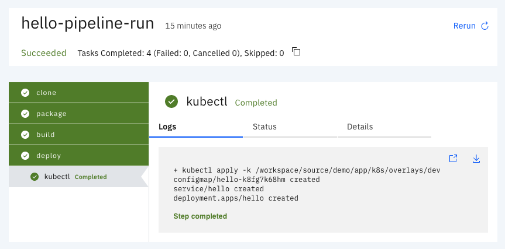

# Karpenter

Tekton tasks to use in CI/CD pipelines.

**Note**: This repository is a work in progress.

## Tasks

The following tasks are available to use:

* git
* mvn
* buildah
* s2i
* kubectl

## Demo

The following demo consists on a sample pipeline to demonstrate the use of Karpenter tasks and Tekton pipelines.

### Run on Minikube

Start a Minikube instance:

    minikube start --memory=8g

Install a registry:

    minikube addons enable registry

Install Tekton pipelines and Tekton dashboard

    kubectl apply --filename https://storage.googleapis.com/tekton-releases/pipeline/latest/release.yaml
    kubectl apply --filename https://github.com/tektoncd/dashboard/releases/latest/download/tekton-dashboard-release.yaml

Create a namespace to deploy the application:

    kubectl create namespace hello

Create the tasks needed by the pipeline:

    kubectl apply -f ./tasks/git/git.yaml -n hello
    kubectl apply -f ./tasks/mvn/mvn.yaml -n hello
    kubectl apply -f ./tasks/buildah/buildah.yaml -n hello
    kubectl apply -f ./tasks/kubectl/kubectl.yaml -n hello

Finally create the pipeline resources:

    kubectl apply -f ./demo/pipeline.yaml -n hello

    echo "apiVersion: tekton.dev/v1beta1
    kind: PipelineRun
      metadata:
      name: hello-pipeline-run
    spec:
      serviceAccountName: build-bot
      pipelineRef:
        name: hello-pipeline
      workspaces:
      - name: source
        persistentvolumeclaim:
          claimName: source" | kubectl replace -f - -n hello

### Pipeline Overview

