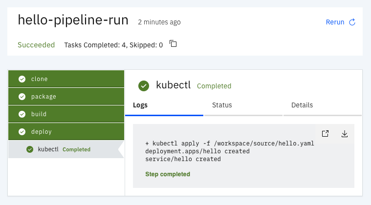

# Karpenter

Tekton tasks to use in CI/CD pipelines.

**Note**: This repository is a work in progress.

## Tasks

The following tasks are available to use:

* git
* mvn
* buildah
* kubectl

## Pipeline

### Run on Minikube

Start a Minikube instance:

    minikube start --memory=8g

Install Tekton pipelines and Tekton dashboard

    kubectl apply --filename https://storage.googleapis.com/tekton-releases/pipeline/latest/release.yaml
    kubectl apply --filename https://github.com/tektoncd/dashboard/releases/latest/download/tekton-dashboard-release.yaml

Create a namespace to deploy the application:

    kubectl create namespace hello

Create the tasks needed by the pipeline:

    kubectl apply -f ./tasks/git/git.yaml -n hello
    kubectl apply -f ./tasks/mvn/mvn.yaml -n hello
    kubectl apply -f ./tasks/buildah/buildah.yaml -n hello
    kubectl apply -f ./tasks/kubectl/kubectl.yaml -n hello

    kubectl apply -f ./pipeline.yaml -n hello

### Pipeline Overview

